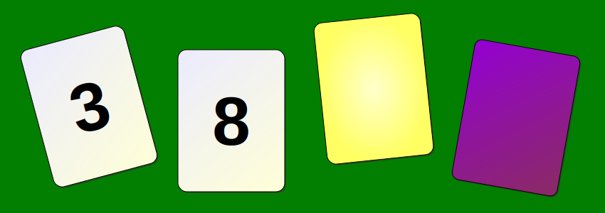
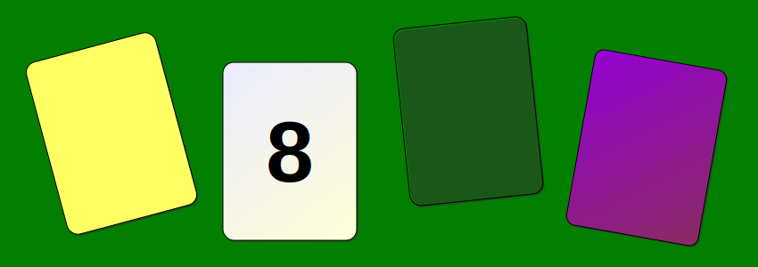
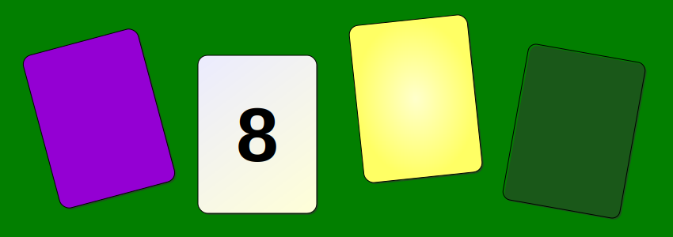
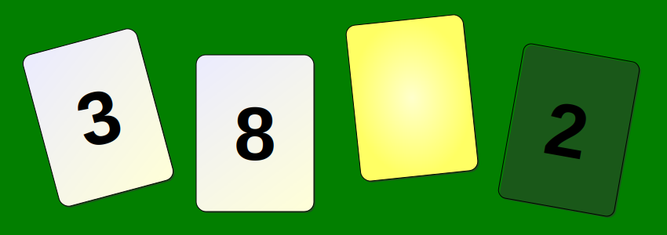

---
author:
- David Sanson
title: 'Phi 112: Day 8'
subtitle: The Wason Selection Task
date: 10 September 2020
title-slide-attributes:
    data-background-image: img/wason.svg
    data-background-size: fill
    data-background-opacity: .2
theme: moon
controls: true
hashOneBasedIndex: true
hash: true
respondToHashChanges: true
history: false
center: false
...

# Agenda

-   Check in
-   Warmup
-   Working Breakouts

## Course Updates

-   Lectures for Unit 4 are up on Youtube, linked from the Overview page on
    Carnap
-   A first draft of Unit 5 Reading is up.
-   Retake! Do it! Or wait, and do it later.
-   Office Hours: TuTh noon to 1pm on Discord

------

-   Issues, Questions, Puzzles, Uncertainties?

# Warm Up

## Wason Selection Task{data-transition=fade}

If a card is even-numbered, then it is purple.

## Bartender Quiz

-  Four people order drinks: 
   -   person A orders a coke,
   -   person B person orders a beer,
   -   person C is 18. 
   -   person D is 25,
-  Whose ID do you need to check? Whose order do you need to check?

## Results

-   I am assuming y'all passed the bartender quiz and most of you failed the
    Wason selection task. (I'm writing this the night before class.)
-   But the two tasks are logically equivalent.

## Flip the 3?{data-transition=fade}

 <!-- -->

If a card is even-numbered, then it is purple.

False?

## Flip the 3?{data-transition=fade}

 <!-- -->

If a card is even-numbered, then it is purple.

False?

## Flip the 3?{data-transition=fade}

 <!-- -->

If a card is even-numbered, then it is purple.

False?

## Flip the 3?{data-transition=fade}

 <!-- -->

If a card is even-numbered, then it is purple.

False?

## Flip the 8?{data-transition=fade}

 <!-- -->

If a card is even-numbered, then it is purple.

False?

## Flip the 8?{data-transition=fade}

 <!-- -->

If a card is even-numbered, then it is purple.

*False*.

## Flip the 8?{data-transition=fade}

 <!-- -->

If a card is even-numbered, then it is purple.

False?

## Flip the 8?{data-transition=fade}

 <!-- -->

If a card is even-numbered, then it is purple.

False?

## Flip the Yellow?{data-transition=fade}

 <!-- -->

If a card is even-numbered, then it is purple.

False?

## Flip the Yellow?{data-transition=fade}

 <!-- -->

If a card is even-numbered, then it is purple.

*False*.

## Flip the Yellow?{data-transition=fade}

 <!-- -->

If a card is even-numbered, then it is purple.

False?

## Flip the Yellow?{data-transition=fade}

 <!-- -->

If a card is even-numbered, then it is purple.

False?

## Flip the Purple?{data-transition=fade}

 <!-- -->

If a card is even-numbered, then it is purple.

False?

## Flip the Purple?{data-transition=fade}

 <!-- -->

If a card is even-numbered, then it is purple.

False?

## Flip the Purple?{data-transition=fade}

 <!-- -->

If a card is even-numbered, then it is purple.

False? 

## Flip the Purple?{data-transition=fade}

 <!-- -->

If a card is even-numbered, then it is purple.

False? 

## Summary

-   Flip the 3? No: either way, won't violate the rule.
-   Flip the 8? Yes: if yellow, the rule is violated.
-   Flip the yellow? Yes: if even, the rule is violated.
-   Flip the purple? No: either way, won't violate the rule.

## Summary

-   Card the coke? No: either way, won't violate the rule.
-   Card the beer? Yes: if underage, the rule is violated.
-   Check 18y order? Yes: if alcohol, rule violated.
-   Check the 25y order? No: either way, won't violate the rule.

## So What?

-   Our ability to reason well with conditionals seems to depend a lot on
    context and content, even though the rules governing conditionals do not.
-   Our methods for processing information are not the methods of symbolic
    logic?

# Working Groups

## Breakout Room Reminders

-   introduce yourselves!
-   no lurking! 
-   be inclusive! be supportive!

## Units 1, 2, 3, 4, or 5

-   Task: read and discuss the material and the exercises.
-   Don't just *talk about how you plan to do it later*. Actually *do it*.
-   To join, rename yourself so your name *starts* with "1", "2", "3", "4", or
    "5"

# To Do 

-   Make progress!
-   Retake!
-   Keep talking on Discord.
